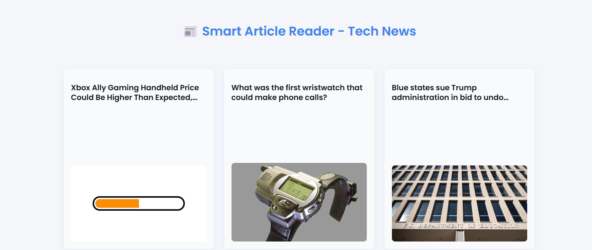
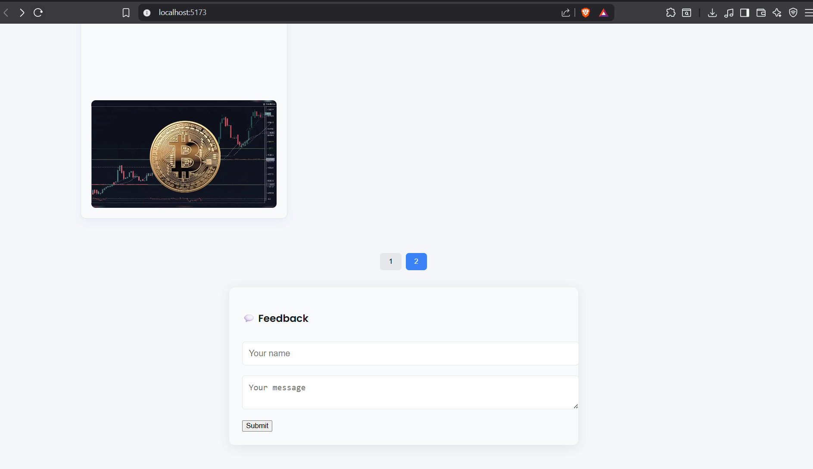
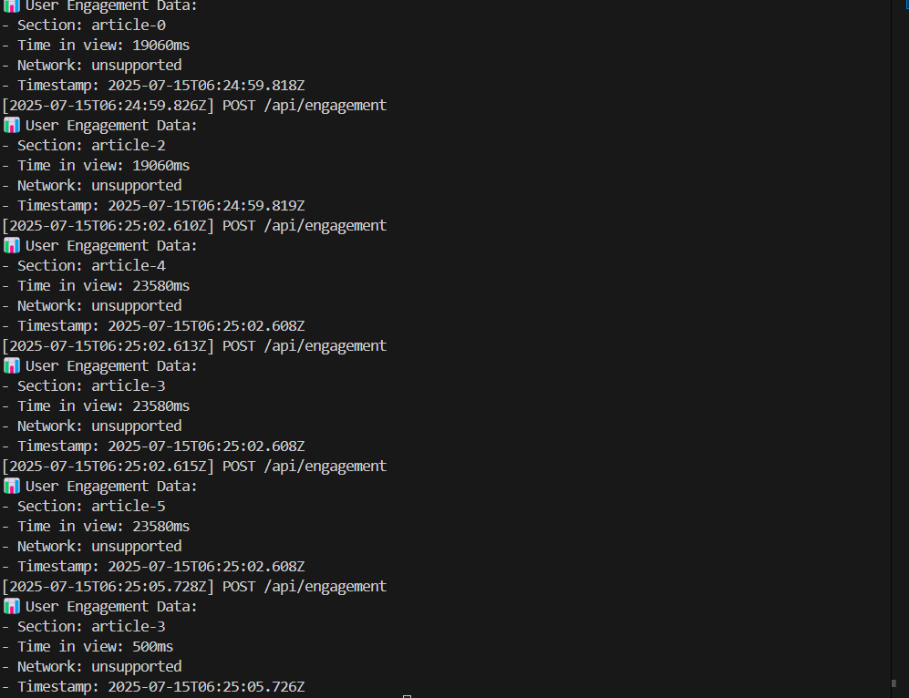

Perfect! Here's your updated `README.md` including all key points and the new screenshot `screenshots/3.png` showing the **user engagement tracking** feature.

---

### ✅ `README.md` (Final Version)

```markdown
# 📰 Smart Article Reader – Tech News with Web API Integration

This project is a **responsive, minimalistic Smart Article Reader** that fetches the latest technology news and enhances user experience with modern browser APIs.

## 🚀 Features

- 📄 Tech News Feed with Responsive Cards
- 🖼 Lazy-loaded Images
- 🔍 Engagement Tracker using `IntersectionObserver`
- 🌐 Network Awareness via `NetworkInformation API`
- 🧠 Background Task Optimization using `requestIdleCallback`
- 🦴 Skeleton Loaders
- 🎯 Article Detail View with Deep Linking
- 📤 Native Share Support (Progressive Enhancement)
- 📝 User Feedback Form

---

## 🌐 Web APIs Used

| API | Purpose |
|-----|---------|
| [Intersection Observer API](https://developer.mozilla.org/en-US/docs/Web/API/Intersection_Observer_API) | Detects when articles enter the viewport to track user engagement. |
| [Network Information API](https://developer.mozilla.org/en-US/docs/Web/API/Network_Information_API) | Warns user about poor connectivity and adapts loading strategies. |
| [Background Tasks API](https://developer.mozilla.org/en-US/docs/Web/API/Background_Tasks_API) *(via `requestIdleCallback`)* | Runs non-urgent tasks during idle time to improve performance. |

---

## 🧩 Tech Stack

- **Frontend:** React (Vite) + CSS
- **Data Source:** NewsData.io API
- **Routing:** React Router
- **Image Optimization:** Lazy loading via custom `LazyImage` component

---

## 📸 Screenshots

### 📰 Home Page – Articles Grid



---

### 📄 Article Detail View



---

### 📈 User Engagement Tracker

> Scroll-based article section interaction tracking using IntersectionObserver.



---

## 📁 Folder Structure

```

src/
├── App.jsx
├── main.jsx
├── components/
│   ├── LazyImage.jsx
│   ├── EngagementTracker.jsx
│   ├── FeedbackForm.jsx
│   ├── SkeletonCard.jsx
│   └── NetworkHandler.jsx
├── pages/
│   └── ArticleDetail.jsx
├── styles/
│   └── app.css

````

---

## 🛠 Setup Instructions

```bash
git clone https://github.com/your-username/smart-article-reader.git
cd smart-article-reader
npm install
````

Create a `.env` file:

```
VITE_NEWSDATA_API_KEY=your_api_key_here
```

Start dev server:

```bash
npm run dev
```

---

## 📬 Feedback

Pull requests are welcome. For major changes, open an issue first to discuss what you would like to change.

---
